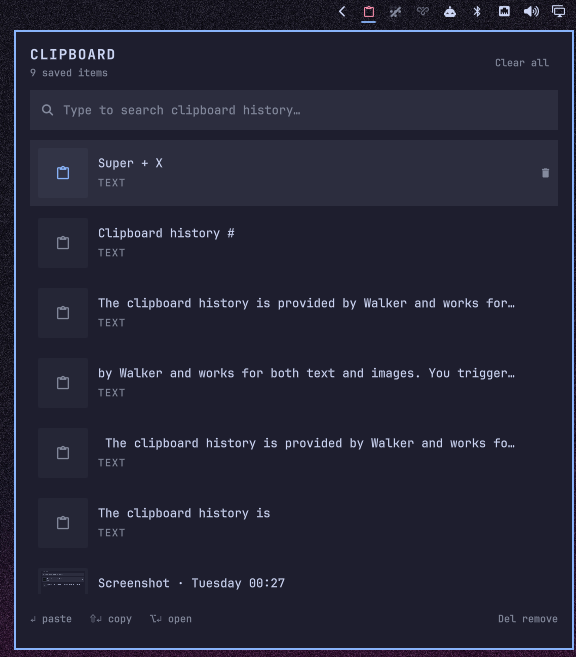

# Clipboard Manager for Omarchy



A theme-aware clipboard history panel for the Omarchy Quattro bar. The widget
lives in the right section by default and opens an anchored panel on left click.

It is deliberately a UI companion to Omarchy's built-in clipboard service. It
reads the same history file and uses Omarchy's own helpers for pasting, copying,
and opening entries, so it does not start a second `wl-paste` watcher.

## Features

- Search clipboard history by typing while the panel is open
- Preview text, copied files, and captured images
- Left click or press Enter to paste an entry
- Right click or press Shift+Enter to copy without pasting
- Press Alt+Enter to open an entry with Omarchy's clipboard opener
- Remove individual entries or clear the complete history
- Keyboard navigation with arrows, Page Up/Down, Home, End, and Escape
- Native Omarchy colors, spacing, bar orientation, and popout coordination

## Requirements

- Omarchy Quattro
- The built-in `omarchy.clipboard` service enabled (the Omarchy default)
- Omarchy's standard clipboard helper commands

The panel consumes
`~/.local/state/omarchy/clipboard-history.json`. Clipboard monitoring and
sensitive-clipboard filtering remain owned by the built-in service.

## Local development

Validate the plugin, link this checkout, and enable it in the right bar section:

```bash
./scripts/check
./scripts/link-local
omarchy plugin enable io.github.vuhuy.clipboard-manager --section right
```

Saving files below the linked checkout should trigger a hot reload. To force a
complete reload:

```bash
./scripts/link-local --reload
```

Remove the development link safely with:

```bash
omarchy plugin remove io.github.vuhuy.clipboard-manager
```

## Install from GitHub

Once published, install and enable it with:

```bash
omarchy plugin add https://github.com/vuhuy/omarchy-plugins.git
omarchy plugin enable io.github.vuhuy.clipboard-manager --section right
```

## Acknowledgements

A lot of integration i borrow from the official
[Omarchy clipboard plugin](https://github.com/basecamp/omarchy/tree/quattro/shell/plugins/clipboard).
The panel itself is designed for this bar-widget plugin.

## License

[MIT](LICENSE)
